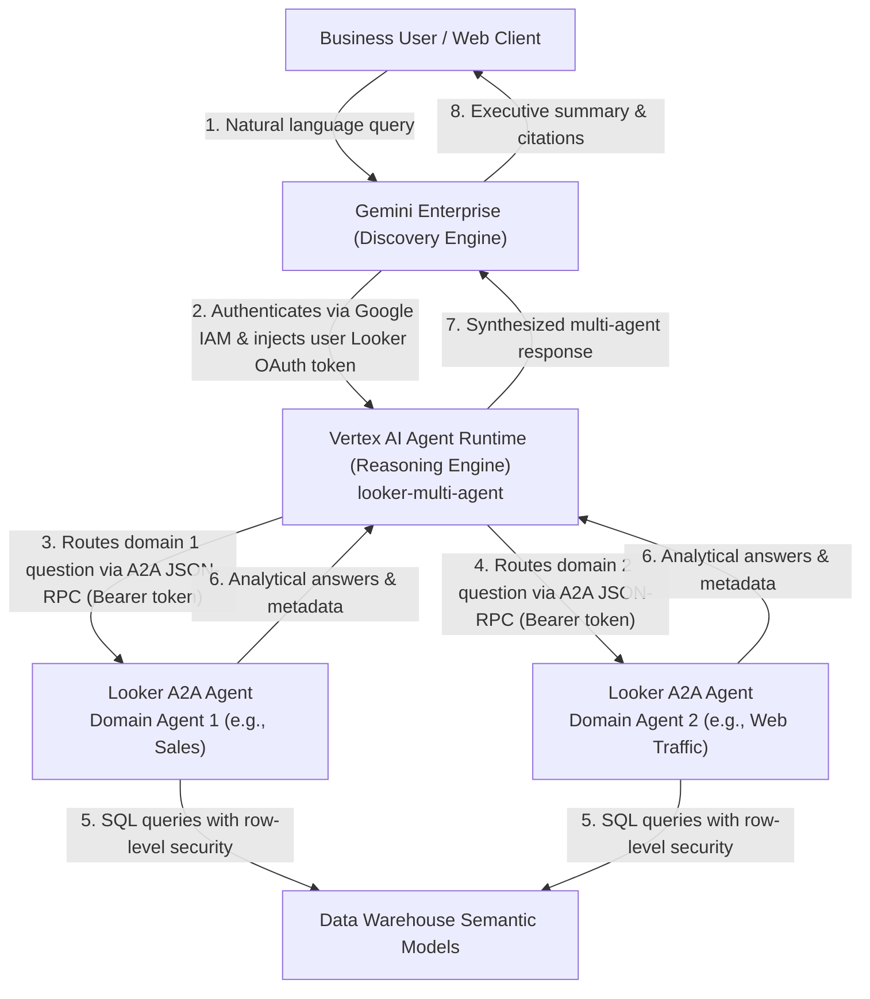

# Looker Multi-Agent Orchestrator

An enterprise agent orchestrator built with the Google Agent Development Kit (ADK) that coordinates multiple specialized Looker Conversational Analytics A2A (Agent-to-Agent) sub-agents. The orchestrator is containerized, deployed to Vertex AI Agent Runtime (Reasoning Engine), and published into Gemini Enterprise with end-to-end user-level Looker OAuth 2.0 PKCE authentication.

---

## Architecture

The orchestrator serves as the single supervisory interface for business users in Gemini Enterprise, delegating specialized analytical domains (e.g., Domain Agent 1 such as Sales Performance, and Domain Agent 2 such as Website Traffic) to dedicated Looker Conversational Analytics agents.



### Authentication Flow

1. **User Authentication**: The user logs into Gemini Enterprise.
2. **OAuth Consent**: Gemini Enterprise manages user OAuth 2.0 PKCE consent against the Looker instance using a configured authorization resource. (Each agent requires its own dedicated authorization resource due to Gemini Enterprise's 1-to-1 authorization binding constraint).
3. **IAM Service Dispatch**: Gemini Enterprise calls the Agent Runtime Reasoning Engine via `:streamQuery` using internal Google Cloud IAM service credentials.
4. **Token Injection**: The user's Looker access token is injected into request and session state (`session.state` and `tool_context.state`).
5. **A2A Invocation**: The ADK orchestrator dynamically resolves the token across candidate keys and forwards it via native A2A JSON-RPC 2.0 (`sendMessage`) with HTTP `Authorization: Bearer <token>` to the Looker A2A API endpoint.
6. **Data Security**: Looker verifies user identity and enforces LookML access grants, user attributes, and row-level data filters before querying the data warehouse.

---

## Prerequisites

- Python 3.11+
- [uv package manager](https://docs.astral.sh/uv/)
- [Google Cloud CLI (`gcloud`)](https://cloud.google.com/sdk/docs/install)
- [Google Agents CLI (`agents-cli`)](https://pypi.org/project/google-agents-cli/):
  ```bash
  uv tool install google-agents-cli
  ```
- Google Cloud project with the following APIs enabled:
  - `aiplatform.googleapis.com` (Vertex AI / Agent Runtime)
  - `discoveryengine.googleapis.com` (Gemini Enterprise)
- Looker instance (Google Cloud core or Looker Hosted) with Conversational Analytics A2A endpoints enabled.

---

## Configuration

Copy the example environment configuration:

```bash
cp .env.example .env
```

Configure the following variables in `.env`:

```ini
# Google Cloud
GOOGLE_CLOUD_PROJECT=<YOUR_PROJECT_ID>
GOOGLE_CLOUD_LOCATION=us-central1
PROJECT_NUMBER=<YOUR_PROJECT_NUMBER>
GEMINI_ENTERPRISE_APP_ID=projects/<PROJECT_NUMBER>/locations/global/collections/default_collection/engines/<APP_ID>

# Looker Instance & Native A2A Domain Agents
LOOKER_BASE_URL=https://<YOUR_LOOKER_HOST>

# Domain Agent 1 (e.g. Sales, Financials)
LOOKER_AGENT_1_NAME="Domain Agent 1"
LOOKER_AGENT_1_DESCRIPTION="Queries primary domain data such as sales, orders, and revenue."
LOOKER_AGENT_1_UUID=<AGENT_1_UUID>

# Domain Agent 2 (e.g. Web Traffic, Operations)
LOOKER_AGENT_2_NAME="Domain Agent 2"
LOOKER_AGENT_2_DESCRIPTION="Queries secondary domain data such as web traffic, sessions, and digital channels."
LOOKER_AGENT_2_UUID=<AGENT_2_UUID>

# Gemini Enterprise Dedicated Authorization
LOOKER_AUTH_ID=<AUTHORIZATION_ID>
AUTH_ID_RESOURCE=projects/<PROJECT_NUMBER>/locations/global/authorizations/<AUTHORIZATION_ID>

# Optional local developer token override (falls back to ~/.config/looker-cli/config.yaml)
LOOKER_A2A_TOKEN=
```

Sub-agents can also be defined declaratively in `config/agents.yaml`.

---

## Gemini Enterprise Authorization Setup

In Gemini Enterprise, each agent requires a dedicated authorization resource (authorization resources cannot be shared across multiple agents in the same assistant).

To create a dedicated OAuth 2.0 PKCE authorization resource:

```bash
TOKEN=$(gcloud auth print-access-token)

curl -X POST \
  -H "Authorization: Bearer $TOKEN" \
  -H "Content-Type: application/json" \
  -H "x-goog-user-project: <PROJECT_ID>" \
  -d '{
    "name": "projects/<PROJECT_NUMBER>/locations/global/authorizations/<AUTHORIZATION_ID>",
    "serverType": "LOOKER",
    "authType": "OAUTH2_AUTH_CODE_FLOW",
    "oauth2AuthCodeFlow": {
      "clientId": "com.looker.geminienterprise",
      "clientSecret": "looker-pkce-dummy-secret",
      "authorizationUri": "https://<YOUR_LOOKER_HOST>/auth",
      "tokenUri": "https://<YOUR_LOOKER_HOST>/api/token",
      "scopes": ["cors_api"],
      "pkceVerificationEnabled": true
    }
  }' \
  "https://discoveryengine.googleapis.com/v1alpha/projects/<PROJECT_NUMBER>/locations/global/authorizations?authorizationId=<AUTHORIZATION_ID>"
```

*Note*: The Discovery Engine API schema requires a non-empty string in `clientSecret` even when `pkceVerificationEnabled` is true; passing a placeholder satisfies the schema while retaining standard RFC 7636 S256 PKCE verification.

---

## Local Development & Verification

Install dependencies:

```bash
uv sync
```

Run a test query through the ADK orchestrator locally:

```bash
# Domain 1 query (e.g. sales / revenue)
uv run python scripts/test_local.py "What was our total revenue last month?"

# Domain 2 query (e.g. web traffic / user sessions)
uv run python scripts/test_local.py "What are our top traffic sources?"

# Multi-agent blended cross-domain query
uv run python scripts/test_local.py "Compare our top traffic source with our total revenue last month."
```

Start the interactive local playground:

```bash
agents-cli playground
```

---

## Deployment to Vertex AI Agent Runtime

Deploy the orchestrator container to Vertex AI Agent Runtime:

```bash
agents-cli deploy \
  --project <PROJECT_ID> \
  --region us-east1 \
  --deployment-target agent_runtime \
  --service-name looker-orchestrator-app \
  --no-confirm-project
```

Upon completion, `agents-cli` writes the deployed engine resource name into `deployment_metadata.json`:

```json
{
  "remote_agent_runtime_id": "projects/<PROJECT_NUMBER>/locations/us-east1/reasoningEngines/<ENGINE_ID>",
  "deployment_target": "agent_runtime",
  "is_a2a": true,
  "agent_directory": "app"
}
```

---

## Publishing to Gemini Enterprise

Register the deployed Reasoning Engine into your Gemini Enterprise application:

```bash
agents-cli publish gemini-enterprise \
  --registration-type adk \
  --agent-runtime-id "projects/<PROJECT_NUMBER>/locations/us-east1/reasoningEngines/<ENGINE_ID>" \
  --gemini-enterprise-app-id "projects/<PROJECT_NUMBER>/locations/global/collections/default_collection/engines/<APP_ID>" \
  --authorization-id "projects/<PROJECT_NUMBER>/locations/global/authorizations/<AUTHORIZATION_ID>" \
  --display-name "Looker Multi-Agent Orchestrator" \
  --description "Coordinates specialized Looker Conversational Analytics domain agents" \
  --tool-description "Answers cross-domain analytical questions using specialized Looker Conversational Analytics agents"
```

To update an existing agent's Reasoning Engine reference:

```bash
TOKEN=$(gcloud auth print-access-token)

curl -X PATCH \
  -H "Authorization: Bearer $TOKEN" \
  -H "Content-Type: application/json" \
  -H "x-goog-user-project: <PROJECT_ID>" \
  -d '{
    "adkAgentDefinition": {
      "provisionedReasoningEngine": {
        "reasoningEngine": "projects/<PROJECT_NUMBER>/locations/us-east1/reasoningEngines/<ENGINE_ID>"
      }
    }
  }' \
  "https://discoveryengine.googleapis.com/v1alpha/projects/<PROJECT_NUMBER>/locations/global/collections/default_collection/engines/<APP_ID>/assistants/default_assistant/agents/<AGENT_ID>?updateMask=adkAgentDefinition.provisionedReasoningEngine.reasoningEngine"
```

---

## Conversational Continuity & OAuth Flow

1. **First-Time Authorization**: When a user asks an analytical question in Gemini Enterprise, the system presents an authorization prompt to connect the user's Looker account.
2. **Post-Authentication Clean Context**: Once OAuth consent is granted, the token is saved at the user profile level. If authorization occurs after an initial failure in an ongoing chat thread, start a **new chat** in Gemini Enterprise. This starts with a clean context window, allowing the model to invoke the tools on the first turn without conversational inertia from prior failure turns.

---

## Security Best Practices

- **Service Account Isolation**: Deploy the runtime with a dedicated service account limited to `roles/aiplatform.user` and `roles/logging.logWriter`.
- **User Delegation**: No service account keys or permanent database credentials are stored in the orchestrator. All analytical queries execute under the end-user's Looker OAuth identity.
- **VPC & Egress Controls**: In enterprise deployments, Agent Runtime supports private connectivity via network attachments and VPC Service Controls.
- **Trace & Telemetry**: Cloud Trace and OpenTelemetry logging capture orchestration latency and tool dispatch events without recording sensitive customer data payloads.
