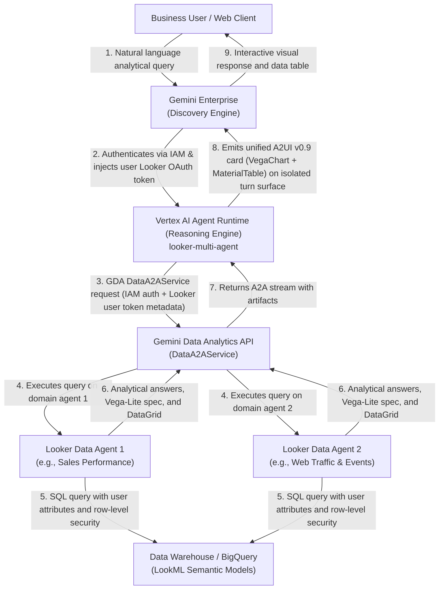

# Looker Multi-Agent Analytics Orchestrator

An enterprise analytics orchestrator built with the Google Agent Development Kit (ADK) that coordinates multiple specialized Looker conversational data agents. The orchestrator is containerized, deployed to Vertex AI Agent Runtime (Reasoning Engine), and published into Gemini Enterprise with end-to-end user-level Looker OAuth 2.0 PKCE identity delegation and interactive A2UI v0.9 visualizations.

---

## Architecture

The orchestrator serves as the primary analytical interface for enterprise users in Gemini Enterprise. It routes user questions across specialized analytical domain agents (such as Domain Agent 1 for Sales and Domain Agent 2 for Web Traffic) powered by the Google Cloud Gemini Data Analytics (GDA) API.



### Identity Delegation & Authentication Flow

1. **User Authentication**: The user logs into Gemini Enterprise.
2. **OAuth Consent**: Gemini Enterprise manages OAuth 2.0 PKCE consent against the Looker instance using a dedicated authorization resource. (Each registered agent in Gemini Enterprise enforces a strict 1-to-1 authorization binding).
3. **IAM Service Dispatch**: Gemini Enterprise invokes the Vertex AI Agent Runtime Reasoning Engine using internal Google Cloud IAM credentials via the `:streamQuery` endpoint.
4. **Token Injection**: The user's Looker access token is injected into request state (`tool_context.state["temp:<AUTH_ID>"]`).
5. **GDA Invocation**: The orchestrator invokes the Gemini Data Analytics API (`geminidataanalytics.googleapis.com/v1/a2a/projects/<PROJECT_ID>/locations/global/dataAgents/<AGENT_ID>/v1/message:stream`) using Google Cloud IAM transport credentials while forwarding the end-user's Looker OAuth access token in request metadata (`https://www.googleapis.com/gemini-enterprise/a2a/extensions/authorizations/v1`).
6. **Data Security**: Looker verifies user identity and enforces LookML access grants, user attributes, and row-level security filters before querying BigQuery or the underlying data warehouse.
7. **Multi-Turn A2UI Rendering**: The orchestrator packages native Looker Vega-Lite chart specifications and DataGrid tabular results into a unified A2UI v0.9 `MaterialCard` container (comprising a `VegaChart` and `MaterialTable` separated by a `MaterialDivider`). Each response generates a cryptographically unique `surfaceId` (`surface_<uuid>`), ensuring earlier conversation turns remain immutable across multi-turn interactions.

---

## Prerequisites

- Python 3.11+
- [uv package manager](https://docs.astral.sh/uv/)
- [Google Cloud CLI (`gcloud`)](https://cloud.google.com/sdk/docs/install)
- [Google Agents CLI (`agents-cli`)](https://pypi.org/project/google-agents-cli/):
  ```bash
  uv tool install google-agents-cli
  ```
- Google Cloud project with the following APIs enabled:
  - `aiplatform.googleapis.com` (Vertex AI Agent Runtime)
  - `discoveryengine.googleapis.com` (Gemini Enterprise)
  - `geminidataanalytics.googleapis.com` (Gemini Data Analytics)
- Looker instance (Google Cloud core or Looker Hosted) connected to Gemini Data Analytics.

---

## IAM Permissions

The Vertex AI Agent Runtime execution service account (`service-<PROJECT_NUMBER>@gcp-sa-aiplatform-re.iam.gserviceaccount.com` or custom runtime service account) requires the following IAM roles on the Google Cloud project hosting the data agents:

- `roles/geminidataanalytics.dataAgentUser`: Required to execute analytical queries against data agents (`geminidataanalytics.dataAgents.chat`).
- `roles/aiplatform.user`: Required for Vertex AI Reasoning Engine execution.
- `roles/logging.logWriter`: Required for Cloud Logging telemetry.

To grant the required GDA role:

```bash
gcloud projects add-iam-policy-binding <PROJECT_ID> \
  --member="serviceAccount:service-<PROJECT_NUMBER>@gcp-sa-aiplatform-re.iam.gserviceaccount.com" \
  --role="roles/geminidataanalytics.dataAgentUser"
```

---

## Configuration

Copy the example environment configuration:

```bash
cp .env.example .env
```

Configure `.env` with your project and Looker resources:

```ini
# Google Cloud & Agent Runtime
GOOGLE_CLOUD_PROJECT=<YOUR_PROJECT_ID>
GOOGLE_CLOUD_LOCATION=us-central1
PROJECT_NUMBER=<YOUR_PROJECT_NUMBER>
GEMINI_ENTERPRISE_APP_ID=projects/<PROJECT_NUMBER>/locations/global/collections/default_collection/engines/<APP_ID>

# Looker Instance & Gemini Data Analytics Domain Agents
LOOKER_BASE_URL=https://<YOUR_LOOKER_HOST>

# Domain Agent 1 (e.g. Sales, Financials)
LOOKER_AGENT_1_NAME="E-Commerce Sales Agent"
LOOKER_AGENT_1_DESCRIPTION="Queries e-commerce sales, product categories, brands, orders, and revenue metrics."
LOOKER_AGENT_1_RESOURCE=projects/<PROJECT_ID>/locations/global/dataAgents/<SALES_AGENT_ID>

# Domain Agent 2 (e.g. Web Traffic, User Activity)
LOOKER_AGENT_2_NAME="Web Traffic & Events Agent"
LOOKER_AGENT_2_DESCRIPTION="Queries website traffic, web sessions, pageviews, and user event activity."
LOOKER_AGENT_2_RESOURCE=projects/<PROJECT_ID>/locations/global/dataAgents/<TRAFFIC_AGENT_ID>

# Gemini Enterprise Dedicated Authorization Resource
LOOKER_AUTH_ID=<AUTHORIZATION_ID>
AUTH_ID_RESOURCE=projects/<PROJECT_NUMBER>/locations/global/authorizations/<AUTHORIZATION_ID>

# Optional local developer token override (falls back to ~/.config/looker-cli/config.yaml)
# LOOKER_A2A_TOKEN=
```

Sub-agents can also be defined declaratively in `config/agents.yaml`.

---

## Gemini Enterprise Authorization Setup

In Gemini Enterprise, each registered agent requires a dedicated authorization resource.

To create the OAuth 2.0 PKCE authorization resource:

```bash
TOKEN=$(gcloud auth print-access-token)

curl -X POST \
  -H "Authorization: Bearer $TOKEN" \
  -H "Content-Type: application/json" \
  -H "x-goog-user-project: <PROJECT_ID>" \
  -d '{
    "name": "projects/<PROJECT_NUMBER>/locations/global/authorizations/<AUTHORIZATION_ID>",
    "serverType": "LOOKER",
    "authType": "OAUTH2_AUTH_CODE_FLOW",
    "oauth2AuthCodeFlow": {
      "clientId": "com.looker.geminienterprise",
      "clientSecret": "looker-pkce-dummy-secret",
      "authorizationUri": "https://<YOUR_LOOKER_HOST>/auth",
      "tokenUri": "https://<YOUR_LOOKER_HOST>/api/token",
      "scopes": ["cors_api"],
      "pkceVerificationEnabled": true
    }
  }' \
  "https://discoveryengine.googleapis.com/v1alpha/projects/<PROJECT_NUMBER>/locations/global/authorizations?authorizationId=<AUTHORIZATION_ID>"
```

*Note*: The Discovery Engine API schema requires a non-empty string in `clientSecret` even when `pkceVerificationEnabled` is true; passing a placeholder satisfies the schema while retaining standard RFC 7636 S256 PKCE verification.

---

## Local Testing & Verification

Install dependencies:

```bash
uv sync
```

Run unit tests:

```bash
uv run pytest tests/unit
```

Run a test query through the ADK orchestrator locally:

```bash
# Domain 1 query (sales / revenue)
uv run python scripts/test_local.py "What were the top 5 brands by revenue last quarter?"

# Domain 2 query (web traffic / sessions)
uv run python scripts/test_local.py "What are our top traffic acquisition channels?"

# Blended cross-domain query
uv run python scripts/test_local.py "Compare our top traffic channel with revenue by category."
```

Start the interactive local playground:

```bash
agents-cli playground
```

---

## Deployment to Vertex AI Agent Runtime

Deploy the containerized orchestrator to Vertex AI Agent Runtime (Reasoning Engine):

```bash
agents-cli deploy \
  --project <PROJECT_ID> \
  --region us-east1 \
  --deployment-target agent_runtime \
  --no-confirm-project
```

The deployment process builds the container, registers the agent runtime endpoints (`/a2a/app/.well-known/agent-card.json`), and updates `deployment_metadata.json`:

```json
{
  "remote_agent_runtime_id": "projects/<PROJECT_NUMBER>/locations/us-east1/reasoningEngines/<ENGINE_ID>",
  "deployment_target": "agent_runtime",
  "is_a2a": true,
  "agent_directory": "app"
}
```

Verify the live agent card:

```bash
curl -s -H "Authorization: Bearer $(gcloud auth print-access-token)" \
  "https://us-east1-aiplatform.googleapis.com/reasoningEngines/v1/projects/<PROJECT_NUMBER>/locations/us-east1/reasoningEngines/<ENGINE_ID>/api/a2a/app/.well-known/agent-card.json"
```

---

## Publishing to Gemini Enterprise

Register the deployed Reasoning Engine into Gemini Enterprise using native ADK mode:

```bash
agents-cli publish gemini-enterprise \
  --registration-type adk \
  --agent-runtime-id "projects/<PROJECT_NUMBER>/locations/us-east1/reasoningEngines/<ENGINE_ID>" \
  --gemini-enterprise-app-id "projects/<PROJECT_NUMBER>/locations/global/collections/default_collection/engines/<APP_ID>" \
  --authorization-id "projects/<PROJECT_NUMBER>/locations/global/authorizations/<AUTHORIZATION_ID>" \
  --display-name "Looker Multi-Agent Orchestrator" \
  --description "Coordinates specialized Looker conversational analytics agents across sales, web traffic, and operations" \
  --tool-description "Answers cross-domain analytical questions using specialized Looker conversational analytics agents"
```

To update an existing registered agent in Gemini Enterprise with a newly deployed Reasoning Engine:

```bash
TOKEN=$(gcloud auth print-access-token)

curl -X PATCH \
  -H "Authorization: Bearer $TOKEN" \
  -H "Content-Type: application/json" \
  -H "x-goog-user-project: <PROJECT_ID>" \
  -d '{
    "adkAgentDefinition": {
      "provisionedReasoningEngine": {
        "reasoningEngine": "projects/<PROJECT_NUMBER>/locations/us-east1/reasoningEngines/<ENGINE_ID>"
      }
    }
  }' \
  "https://discoveryengine.googleapis.com/v1alpha/projects/<PROJECT_NUMBER>/locations/global/collections/default_collection/engines/<APP_ID>/assistants/default_assistant/agents/<AGENT_ID>?updateMask=adkAgentDefinition.provisionedReasoningEngine.reasoningEngine"
```

---

## Multi-Turn A2UI Visualization Protocol

The orchestrator adheres to the Gemini Enterprise A2UI v0.9 specification:

- **Unified Card Layout**: Both the interactive `VegaChart` and `MaterialTable` are nested inside a single `MaterialCard` root container separated by `MaterialDivider`. This prevents multi-surface display collisions in the Gemini Enterprise client widget.
- **Surface Isolation**: Every analytical response generates a unique `surfaceId` (`surface_<uuid>`). The frontend UCS widget registers and anchors surfaces by ID; generating unique IDs per turn ensures previous turn cards remain immutable when subsequent turns are dispatched.
- **Strict String Schema Typing**: Per the Gemini Enterprise composite catalog schema, all cell values in `MaterialTable.rows` are string-formatted (`str(val)`). Non-string values are converted to string format to pass client-side Ajv schema validation.
- **Envelope Wrapping**: All A2UI JSON payloads are wrapped in the `<a2a_datapart_json>` envelope with outer MIME type `text/plain`. This routes the payload directly to Assistant Server's UI event processor without triggering Google Cloud Storage file conversion.

---

## Security and Governance

- **Zero Hardcoded Credentials**: No database passwords, client secrets, or static tokens are stored in the codebase or runtime images.
- **User Identity Preservation**: Queries are executed in Looker under the delegated OAuth token of the logged-in user. All LookML permissions, user attributes, and row-level access controls are strictly enforced at query execution time.
- **Transport Security**: Communications between Gemini Enterprise, Agent Runtime, and Gemini Data Analytics utilize Google Cloud IAM transport authentication over TLS.
- **No Unsanitized Data Logging**: OpenTelemetry and Cloud Trace integrations capture execution latencies and function dispatch traces without logging raw data table rows.
